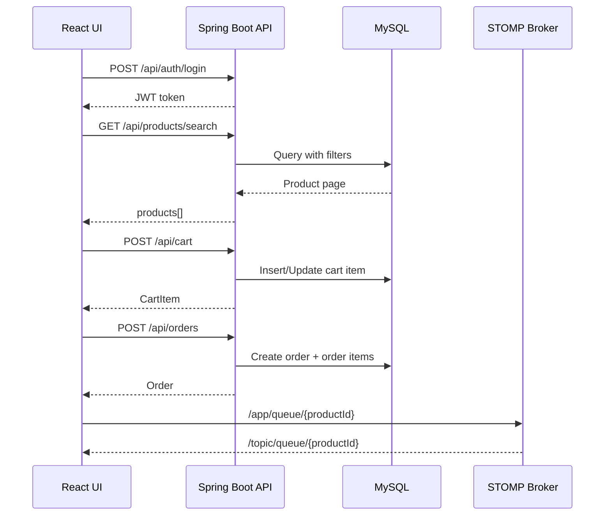

# RocketDrop API Documentation

Base URL: http://localhost:8080
API Prefix: /api
Transport:
- REST over HTTP/JSON
- STOMP over WebSocket (SockJS fallback)

## Authentication Overview

Auth token format:
- Authorization: Bearer <jwt_token>

Role model:
- CUSTOMER: cart, wishlist, addresses, order placement, queue position/join/leave
- ADMIN: admin product/category management, order status management
- Public: product/category browsing, auth login/register, websocket handshake

Security rules (high-level):
- Public: /api/auth/**, GET /api/products/**, GET /api/categories/**, /ws/**
- Admin: /api/admin/**, /api/orders/admin, PUT /api/orders/{id}/status
- Customer: /api/cart/**, /api/wishlist/**, /api/addresses/**, POST /api/orders

## Common Response Shapes

Auth success:
```json
{
  "token": "<jwt>",
  "user": {
    "id": 1,
    "email": "user@example.com",
    "name": "User",
    "phone": "+911234567890",
    "role": "CUSTOMER"
  }
}
```

Validation error:
```json
{
  "message": "Validation failed",
  "errors": [
    { "field": "email", "message": "Enter a valid email address" }
  ]
}
```

Generic error:
```json
{ "message": "Something went wrong. Please try again." }
```

## REST Endpoints

## 1. Authentication

### POST /api/auth/register
Create account and return token.

Request body:
```json
{
  "email": "user@example.com",
  "password": "StrongPass123",
  "name": "User Name",
  "phone": "+919876543210"
}
```

### POST /api/auth/login
Login and return token.

Request body:
```json
{
  "email": "user@example.com",
  "password": "StrongPass123"
}
```

## 2. Product Catalog (Public)

### GET /api/products
Get all products.

### GET /api/products/{id}
Get product by id.

### GET /api/products/search
Search/filter/paginate products.

Query params:
- keyword: string
- category: number
- minPrice: decimal
- maxPrice: decimal
- availability: IN_STOCK | SOLD_OUT
- sortBy: newest | priceAsc | priceDesc
- page: number (default 0)
- size: number (default 8)

Response:
```json
{
  "products": [],
  "page": 0,
  "size": 8,
  "totalPages": 1,
  "totalElements": 0
}
```

### GET /api/products/category/{categoryId}
Products in a category.

### GET /api/products/drops
Drop-specific listing.

### GET /api/products/available
Available products.

### GET /api/products/{id}/similar
Similar products.

### GET /api/products/server-time
Returns server epoch milliseconds.

## 3. Categories

### GET /api/categories
Public category list.

## 4. User Profile

### GET /api/users/me
Authenticated profile.

### PUT /api/users/me
Update name and phone.

Request body:
```json
{
  "name": "Updated Name",
  "phone": "+911234567890"
}
```

### PUT /api/users/me/password
Change password.

Request body:
```json
{
  "oldPassword": "OldPass123",
  "newPassword": "NewPass123"
}
```

## 5. Addresses (CUSTOMER)

### GET /api/addresses
Get user addresses.

### POST /api/addresses
Create address.

### PUT /api/addresses/{addressId}
Update address.

### DELETE /api/addresses/{addressId}
Delete address.

Address request body:
```json
{
  "label": "Home",
  "line1": "Street 1",
  "line2": "Near Market",
  "city": "Mumbai",
  "state": "MH",
  "zip": "400001",
  "country": "India"
}
```

## 6. Cart (CUSTOMER)

### GET /api/cart
Get current cart.

### POST /api/cart
Add product to cart.

Request body:
```json
{
  "productId": 1,
  "quantity": 2
}
```

### PUT /api/cart/{productId}
Update cart quantity.

Request body:
```json
{ "quantity": 3 }
```

### DELETE /api/cart/{productId}
Remove single product from cart.

### DELETE /api/cart
Clear cart.

## 7. Wishlist (CUSTOMER)

### GET /api/wishlist
Returns array of product IDs.

### POST /api/wishlist
Add product.

Request body:
```json
{ "productId": 1 }
```

### DELETE /api/wishlist/{productId}
Remove product.

## 8. Orders

### POST /api/orders (CUSTOMER)
Place order from cart using address.

Request body:
```json
{ "addressId": 10 }
```

### GET /api/orders (CUSTOMER)
Get user orders.

### GET /api/orders/{orderId} (CUSTOMER or ADMIN)
Get order details.

### PUT /api/orders/{orderId}/status (ADMIN)
Update order status.

Request body:
```json
{ "status": "SHIPPED" }
```

Allowed statuses (model):
- PLACED
- SHIPPED
- DELIVERED
- CANCELLED

### GET /api/orders/admin (ADMIN)
Get all orders.

## 9. Queue APIs

### GET /api/queue/{productId}
Get queue list for product.

### GET /api/queue/{productId}/position (CUSTOMER)
Get current user queue position.

### POST /api/queue/{productId}/join (CUSTOMER)
Join queue.

### POST /api/queue/{productId}/leave (CUSTOMER)
Leave queue.

## 10. Admin APIs (ADMIN)

Namespace: /api/admin

### Image Upload
#### POST /api/admin/uploads/image
Multipart upload with form field file.

Returns:
```json
{ "url": "https://... or /uploads/..." }
```

Possible error:
```json
{ "message": "Image size should be 2MB or less" }
```

### Product Management
- GET /api/admin/products
- POST /api/admin/products
- PUT /api/admin/products/{productId}
- DELETE /api/admin/products/{productId}

Create/Update request body fields:
- name: string
- description: string
- price: number
- stock: number
- categoryId: number
- dropTime: optional ISO date-time or null
- imageUrls: optional string[]

### Category Management
- GET /api/admin/categories
- POST /api/admin/categories
- PUT /api/admin/categories/{categoryId}
- DELETE /api/admin/categories/{categoryId}

Category request body:
```json
{
  "name": "Sneakers",
  "imageUrl": "https://..."
}
```

## WebSocket API

Handshake endpoint:
- /ws (SockJS enabled)

Application destination prefix:
- /app

Broker topics:
- /topic/**
- /queue/**

Client publish destinations:
- /app/view/{productId}
- /app/queue/{productId}

Subscription topics:
- /topic/viewers/{productId}
- /topic/queue/{productId}
- /topic/queue
- /topic/stock/{productId}
- /topic/product/{productId}

### Viewer message
Publish:
```json
{ "action": "enter" }
```
or
```json
{ "action": "leave" }
```

### Queue message
Publish:
```json
{ "action": "join", "email": "user@example.com" }
```
or
```json
{ "action": "leave", "email": "user@example.com" }
```

## API Sequence Diagram


## Notes for Production
- Keep JWT secret and DB credentials in environment variables.
- Do not commit real credentials to source control.
- Add API rate limiting and request logging before public launch.
- For multi-instance scaling with WebSocket, use Redis pub/sub backplane.
