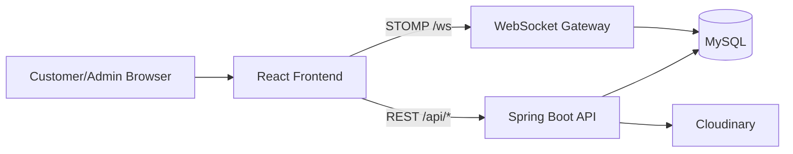
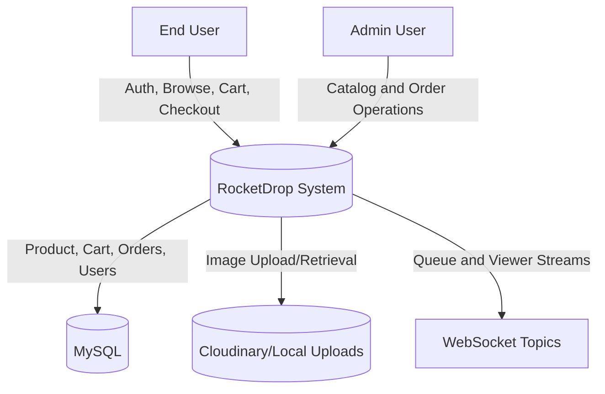
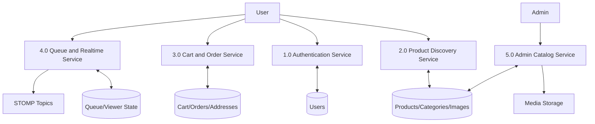

# RocketDrop

RocketDrop is a full-stack, real-time e-commerce platform for limited drops, built with React and Spring Boot.

It combines:
- Product discovery with search/filter
- Drop scheduling and countdown-driven UX
- JWT-secured customer and admin flows
- Cart, wishlist, checkout, and order lifecycle
- Real-time queue/viewer updates over WebSocket

## Table of Contents
- Project Vision
- Core Features
- Tech Stack
- System Architecture
- Data Flow Diagrams (DFD)
- Repository Structure
- Quick Start
- Configuration
- Security Model
- Deployment Guidance
- Documentation Index

## Project Vision
RocketDrop is designed for launch-style commerce where timing, stock, and experience quality are critical. The system supports both customer buying journeys and admin operations with a unified API and consistent data model.

## Core Features

### Customer Features
- Register and login with JWT
- Browse products and categories
- Search and filter products with paginated server-side queries
- View similar products and drop states (LIVE, UPCOMING, SOLD_OUT)
- Manage cart and wishlist
- Save addresses and place orders
- Track order history and order details
- Join and leave drop queues

### Admin Features
- CRUD operations for products and categories
- Product image upload via Cloudinary with local fallback
- Drop scheduling via product dropTime updates
- Order status transitions (PLACED, SHIPPED, DELIVERED, CANCELLED)

### Real-Time Features
- STOMP over WebSocket/SockJS endpoint at /ws
- Live viewer count per product
- Live queue updates for joins/leaves
- Stock update broadcasting channels

## Tech Stack

### Frontend
- React 18
- Vite 7
- Tailwind CSS 3
- Redux Toolkit
- React Router 6
- Axios
- STOMP + SockJS

### Backend
- Java 17
- Spring Boot 4
- Spring Security + JWT
- Spring Data JPA (Hibernate)
- Spring WebSocket (STOMP)
- MySQL
- Cloudinary image storage

## System Architecture

```mermaid
flowchart LR
    U[Customer/Admin Browser] --> F[React Frontend]
    F -->|REST /api/*| B[Spring Boot API]
    F -->|STOMP /ws| W[WebSocket Gateway]
    B --> D[(MySQL)]
    B --> C[Cloudinary]
    W --> D
```

## Data Flow Diagrams (DFD)

### DFD Level 0

```mermaid
flowchart TD
    User[End User] -->|Auth, Browse, Cart, Checkout| RocketDrop[(RocketDrop System)]
    Admin[Admin User] -->|Catalog and Order Operations| RocketDrop
    RocketDrop -->|Product, Cart, Orders, Users| DB[(MySQL)]
    RocketDrop -->|Image Upload/Retrieval| Media[(Cloudinary/Local Uploads)]
    RocketDrop -->|Queue and Viewer Streams| Realtime[WebSocket Topics]
```

### DFD Level 1

```mermaid
flowchart TD
    U[User] --> P1[1.0 Authentication Service]
    U --> P2[2.0 Product Discovery Service]
    U --> P3[3.0 Cart and Order Service]
    U --> P4[4.0 Queue and Realtime Service]
    A[Admin] --> P5[5.0 Admin Catalog Service]

    P1 <--> D1[(Users)]
    P2 <--> D2[(Products/Categories/Images)]
    P3 <--> D3[(Cart/Orders/Addresses)]
    P4 <--> D4[(Queue/Viewer State)]
    P5 <--> D2

    P5 --> M[Media Storage]
    P4 --> T[STOMP Topics]
```

## Repository Structure
```text
RocketDrop/
  backend/
    src/main/java/com/rocketdrop/backend/
      controller/
      service/
      repository/
      model/
      dto/
      config/
    src/main/resources/application.properties
    pom.xml
  frontend/
    src/
      pages/
      components/
      services/
      hooks/
      context/
      utils/
    package.json
  QUICKSTART.md
  PROJECT_OVERVIEW.md
  README.md
```

## Quick Start

### Prerequisites
- Java 17+
- Node.js 18+
- MySQL 8+
- Maven (or use ./mvnw)

### 1) Run backend
```bash
cd backend
./mvnw spring-boot:run
```
Backend base URL: http://localhost:8080

### 2) Run frontend
```bash
cd frontend
npm install
npm run dev
```
Frontend URL: http://localhost:5173

## Configuration
Primary backend configuration is in backend/src/main/resources/application.properties.

Recommended production approach:
- Move secrets to environment variables
- Use managed MySQL (RDS/PlanetScale/Aiven/etc.)
- Keep Cloudinary credentials outside source control

## Security Model
- Stateless JWT authentication
- Role-based access: CUSTOMER, ADMIN
- Endpoint-level authorization with @PreAuthorize
- Protected admin namespace: /api/admin/**

## Deployment Guidance
Recommended split:
- Frontend: Vercel/Netlify/S3+CloudFront
- Backend: Render/Fly/AWS ECS/EC2
- Database: Managed MySQL
- Realtime scaling: Redis pub/sub backplane when using multiple backend instances

## Documentation Index
- API reference: API_DOCUMENTATION.md
- Quick setup: QUICKSTART.md
- Project deep dive: PROJECT_OVERVIEW.md
- Backend setup notes: backend/SETUP_GUIDE.md
- Frontend setup notes: frontend/README_SETUP.md
