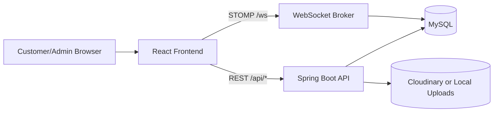
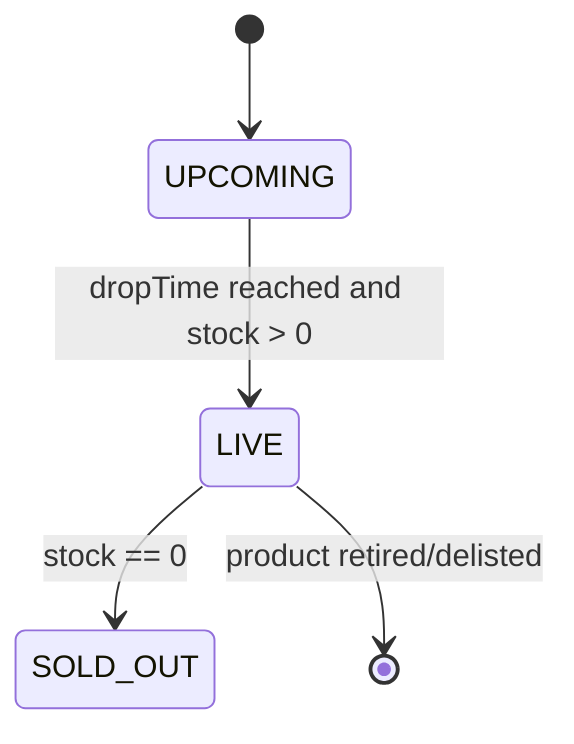
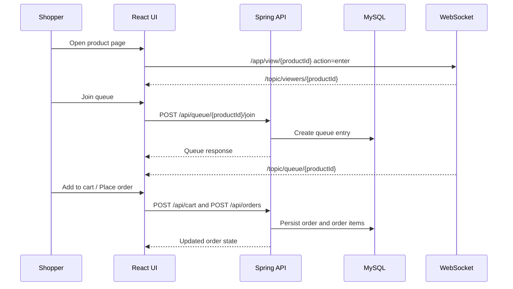
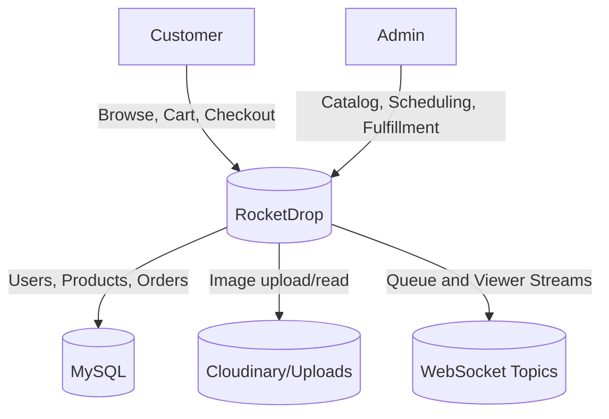
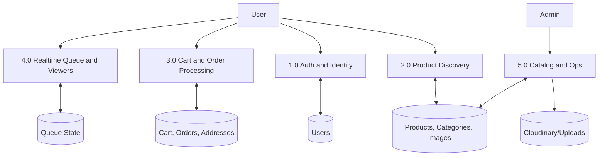

# RocketDrop

A launch-driven e-commerce platform built for limited drops, real-time queues, and fast admin operations.

[](#tech-stack-studio)
[](#tech-stack-studio)
[](#tech-stack-studio)
[](#drop-engine)

## Navigation
- Experience Snapshot
- Tech Stack Studio
- System Architecture
- Drop Engine
- DFD (Level 0 and Level 1)
- Page Experience Map
- Project Structure
- Quick Start
- Configuration and Security
- Deployment Blueprint
- Documentation Hub

## Experience Snapshot
RocketDrop is designed for high-intent product launches where timing and stock matter.

### What it delivers
- Searchable product catalog with server-side filters and sorting
- Time-sensitive drop lifecycle with countdowns
- Queue participation and viewer activity in real time
- Customer flow: auth, cart, addresses, checkout, order tracking
- Admin flow: product/category management, image upload, order status control

### Product statuses
- LIVE
- UPCOMING
- SOLD_OUT

## Tech Stack Studio

| Layer | Stack | Why it fits RocketDrop |
|---|---|---|
| UI | React, Vite, Tailwind CSS | Fast interactions, modern responsive interfaces |
| State | Redux Toolkit, Context APIs | Predictable app state and scalable feature growth |
| API | Spring Boot, Spring MVC | Strong domain modeling and mature ecosystem |
| Security | Spring Security, JWT | Stateless auth and role-based control |
| Data | MySQL, Spring Data JPA | Relational consistency for orders and inventory |
| Realtime | STOMP, SockJS, WebSocket | Live queue and viewer updates |
| Media | Cloudinary + local fallback | Reliable image handling across environments |

<details>
<summary><strong>Installed Key Packages</strong></summary>

- Frontend: react, react-router-dom, @reduxjs/toolkit, axios, @stomp/stompjs, sockjs-client, tailwindcss, lucide-react
- Backend: spring-boot-starter-data-jpa, spring-boot-starter-security, spring-boot-starter-websocket, jjwt, mysql-connector-j, cloudinary

</details>

## System Architecture

```mermaid
flowchart LR
    U[Customer/Admin Browser] --> F[React Frontend]
    F -->|REST /api/*| B[Spring Boot API]
    F -->|STOMP /ws| W[WebSocket Broker]
    B --> DB[(MySQL)]
    B --> M[(Cloudinary or Local Uploads)]
    W --> DB
```

## Drop Engine
The drop system is built to make launch events explicit and trackable.


```mermaid
stateDiagram-v2
    [*] --> UPCOMING
    UPCOMING --> LIVE: dropTime reached and stock > 0
    LIVE --> SOLD_OUT: stock == 0
    LIVE --> [*]: product retired/delisted
```


```mermaid
sequenceDiagram
    participant User as Shopper
    participant UI as React UI
    participant API as Spring API
    participant DB as MySQL
    participant WS as WebSocket

    User->>UI: Open product page
    UI->>WS: /app/view/{productId} action=enter
    WS-->>UI: /topic/viewers/{productId}

    User->>UI: Join queue
    UI->>API: POST /api/queue/{productId}/join
    API->>DB: Create queue entry
    API-->>UI: Queue response
    WS-->>UI: /topic/queue/{productId}

    User->>UI: Add to cart / Place order
    UI->>API: POST /api/cart and POST /api/orders
    API->>DB: Persist order and order items
    API-->>UI: Updated order state
```

## DFD (Level 0 and Level 1)

### DFD Level 0

```mermaid
flowchart TD
    Customer[Customer] -->|Browse, Cart, Checkout| System[(RocketDrop)]
    Admin[Admin] -->|Catalog, Scheduling, Fulfillment| System
    System -->|Users, Products, Orders| DB[(MySQL)]
    System -->|Image upload/read| Media[(Cloudinary/Uploads)]
    System -->|Queue and Viewer Streams| RT[(WebSocket Topics)]
```

### DFD Level 1

```mermaid
flowchart TD
    U[User] --> A1[1.0 Auth and Identity]
    U --> A2[2.0 Product Discovery]
    U --> A3[3.0 Cart and Order Processing]
    U --> A4[4.0 Realtime Queue and Viewers]
    AD[Admin] --> A5[5.0 Catalog and Ops]

    A1 <--> D1[(Users)]
    A2 <--> D2[(Products, Categories, Images)]
    A3 <--> D3[(Cart, Orders, Addresses)]
    A4 <--> D4[(Queue State)]
    A5 <--> D2
    A5 --> Media[(Cloudinary/Uploads)]
```

## Page Experience Map

| Route | Persona | Purpose | Highlights |
|---|---|---|---|
| / | Visitor | Brand + launch entry | Hero, spotlight content |
| /products | Visitor/Customer | Product discovery | Search, filters, infinite loading |
| /products/:id | Visitor/Customer | Product deep dive | Gallery, countdown, queue interactions |
| /drops | Visitor/Customer | Drop-centric browsing | LIVE/UPCOMING experience |
| /cart | Customer | Purchase staging | Quantity, totals, item control |
| /checkout | Customer | Order placement | Address-driven checkout |
| /orders | Customer | Fulfillment visibility | Status timeline |
| /profile | Customer | Account management | Profile and password updates |
| /wishlist | Customer | Saved intent list | Quick re-entry to products |
| /admin | Admin | Operations control center | Analytics cards, quick overview |
| /admin?tab=products | Admin | Product operations | Add/edit/delete, image audit, drop schedule |
| /admin?tab=orders | Admin | Fulfillment operations | Status management |
| /admin?tab=categories | Admin | Taxonomy management | Category add/delete |

## Project Structure
```text
RocketDrop/
  backend/
    src/main/java/com/rocketdrop/backend/
      config/
      controller/
      dto/
      model/
      repository/
      security/
      service/
    src/main/resources/application.properties
    pom.xml
  frontend/
    src/
      components/
      context/
      hooks/
      layouts/
      pages/
      services/
      store/
      utils/
    package.json
  API_DOCUMENTATION.md
  QUICKSTART.md
  PROJECT_OVERVIEW.md
  README.md
```

## Quick Start

### Prerequisites
- Java 17+
- Node.js 18+
- MySQL 8+

### Run backend
```bash
cd backend
./mvnw spring-boot:run
```
Backend: http://localhost:8080

### Run frontend
```bash
cd frontend
npm install
npm run dev
```
Frontend: http://localhost:5173

<details>
<summary><strong>Build commands</strong></summary>

```bash
# backend
cd backend
./mvnw clean package -DskipTests

# frontend
cd frontend
npm run build
npm run preview
```

</details>

## Configuration and Security

Primary app config file:
- backend/src/main/resources/application.properties

Security model:
- JWT stateless authentication
- Role-based access (CUSTOMER, ADMIN)
- Admin namespace: /api/admin/**
- Public browsing for product/category GET endpoints

Production safety checklist:
- Move all secrets to environment variables
- Rotate exposed credentials before deployment
- Enable managed backups and monitoring

## Deployment Blueprint

Recommended setup:
- Frontend: Vercel or Netlify
- Backend: ECS/Render/Fly/EC2
- Database: Managed MySQL (RDS, PlanetScale, Aiven, etc.)
- Realtime scale-out: Redis pub/sub backplane when running multiple API instances

## Documentation Hub
- API reference: API_DOCUMENTATION.md
- Quick setup: QUICKSTART.md
- Deep project notes: PROJECT_OVERVIEW.md
- Backend setup: backend/SETUP_GUIDE.md
- Frontend setup: frontend/README_SETUP.md
